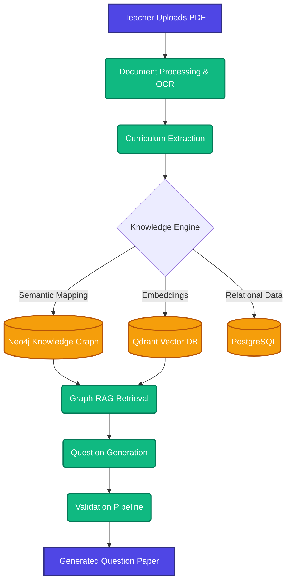

<div align="center">
  <h1>TESTBOOST.AI</h1>
  <p><strong>An AI-powered assessment generation platform that transforms educational materials into curriculum-aware question papers using Graph-RAG, knowledge graphs, Bloom's Taxonomy alignment, and multi-stage validation.</strong></p>
</div>

---

## 🛑 The Problem

Creating high-quality, balanced question papers is a time-consuming, manual process for educators. It often suffers from:
- **Lack of alignment** with strict syllabus blueprints and Bloom's Taxonomy.
- **Inconsistent difficulty** across different assessments.
- **Tedious cross-referencing** against course outcomes (COs) and vast reference materials (textbooks, slides, notes).

## 💡 The Solution

**TESTBOOST.AI** automates this workflow. It digests your entire curriculum context—textbooks, syllabi, past papers—and generates precise, validated question papers that adhere to your exact blueprint constraints (marks distribution, difficulty curves, cognitive levels). 

---

## 🏗️ Architecture

TESTBOOST.AI employs a robust, modular architecture combining Vector Search and Graph RAG to ensure semantic accuracy and relational context.



---

## ✨ Features

- **Document Analysis**: Automated parsing of PDFs, DOCX, PPTX, TXT with smart metadata filtering and OCR for scanned documents.
- **Graph RAG**: Unifies Qdrant (vector index) and Neo4j (semantic graph) to answer complex, multi-hop curriculum queries.
- **Blueprint-Driven Generation**: Strictly adheres to targets for marks, Bloom's Taxonomy, and difficulty distributions.
- **Multi-Stage Validation**: Output is validated against original context to prevent AI hallucinations.
- **Async Task Processing**: Background document chunking and embedding handled reliably via Celery & Redis.

---

## 📸 Screenshots

*(Add your beautiful application screenshots here to showcase the UI/UX)*

> **Placeholder:**
> - Dashboard View
> - PDF Upload & Processing View
> - Blueprint Configuration
> - Final Question Paper Output

---

## 🛠️ Tech Stack

### Backend
- **Core:** FastAPI (Python 3.10+)
- **Databases:** PostgreSQL (SQLAlchemy), Qdrant (Vector), Neo4j (Graph)
- **Task Queue:** Celery & Redis
- **AI/LLM:** LangChain, LangGraph, Groq / Gemini / OpenAI APIs

### Frontend
- **Framework:** Next.js (App Router, React 19)
- **Styling:** Tailwind CSS v4
- **Icons:** Lucide Icons

---

## ⚙️ How It Works

1. **Ingestion:** Educators upload raw materials. The backend extracts text, resolves OCR, and chunks the data.
2. **Knowledge Mapping:** Chunks are embedded into Qdrant. Entities and relationships are extracted to populate the Neo4j Knowledge Graph.
3. **Configuration:** The user defines a Blueprint (e.g., 50 marks, 40% Application level, 20% Hard difficulty).
4. **Retrieval & Generation:** Graph-RAG queries the unified context. An LLM agent generates questions matching the blueprint.
5. **Validation:** A secondary AI pipeline verifies each question's accuracy and relevance against the source text.
6. **Export:** The final paper is rendered and can be exported as PDF/DOCX.

---

## 🚀 Installation

### Option A: Docker Compose (Recommended)

1. **Configure Environment:**
   ```bash
   cp backend/.env.example backend/.env
   # Add your API keys (Gemini, OpenAI, Groq)
   ```
2. **Spin up Core Stack:**
   ```bash
   docker compose up -d
   ```
3. **Spin up Full AI Stack (Celery, Vector, Graph):**
   ```bash
   docker compose --profile celery --profile ai up -d
   ```

### Option B: Local Development

**Backend:**
```bash
cd backend
python -m venv venv
source venv/bin/activate  # Windows: .\venv\Scripts\activate
pip install -r requirements.txt
uvicorn app.main:app --reload
```
*Optional (in separate terminal):* `celery -A worker.celery_app worker --loglevel=info --pool=solo`

**Frontend:**
```bash
cd frontend
npm install
npm run dev
```

**Interface URLs:**
- Frontend: `http://localhost:3000`
- API Docs: `http://localhost:8000/docs`
- Celery Dashboard: `http://localhost:5555`

---

## 🗺️ Roadmap

- [ ] Interactive Canvas for manual question tweaking
- [ ] Multi-tenant support for different schools/departments
- [ ] Auto-grading module for student submissions
- [ ] Export directly to Canvas/Moodle LMS

---
<div align="center">
  <i>Built to bridge the gap between educational content and effective assessment.</i>
</div>
